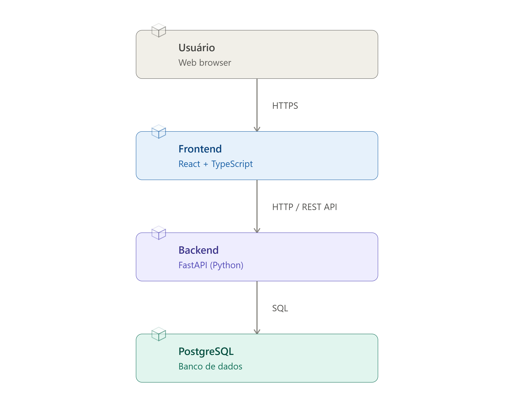

# 🌌 ORBI — Gerenciamento de Orçamento Inteligente

Software de gerenciamento financeiro pessoal que ajuda usuários a controlar receitas, despesas e planejamento financeiro, centralizando as informações e facilitando a tomada de decisão no dia a dia — sem depender de cadernos ou planilhas complexas.

```
Projeto acadêmico desenvolvido para a disciplina de Engenharia de Software.
```
## Sobre o projeto

Muitas pessoas têm dificuldade em gerenciar suas finanças de forma rápida e eficaz, o que frequentemente leva a dívidas por falta de planejamento. O ORBI centraliza receitas, despesas e metas financeiras em um só lugar, com cálculos automáticos de saldo e visualização clara da situação orçamentária do usuário.


## Tecnologias

Backend:
  - Python
  - FastAPi
  - SQLAlchemy
  - PostgreSQL

Frontend:
  - React
  - TypeScript
  - Vite


## Arquitetura




## Equipe
  Nathalia Ferreira De Sousa
  Pedro Felipe dos Santos
